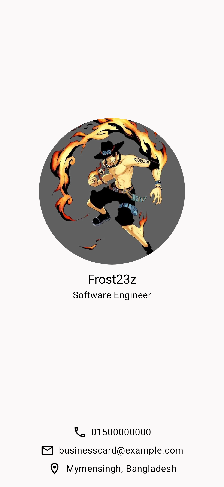

# Business Card App

This is a simple business card app built with Jetpack Compose. The app displays a business card featuring a logo, name, job title, and contact information. The layout adjusts dynamically based on the device's orientation (portrait or landscape). This project serves as practice for learning the basics of Jetpack Compose.

## New Concepts Learned

- **Components**
  - `Text` and `Image` composables for displaying text and images.
- **Layouts**
  - `Box`, `Column`, and `Row` composables for arranging UI elements.
  - `Modifier` class for applying styling and layout constraints.
  - `Spacer` composable for adding space between elements.

## Features

- **Responsive Business Card Display**:
  - Showcases a business card with a logo, name, job title, and contact information, adapting to both portrait and landscape orientations.

## Screenshots

