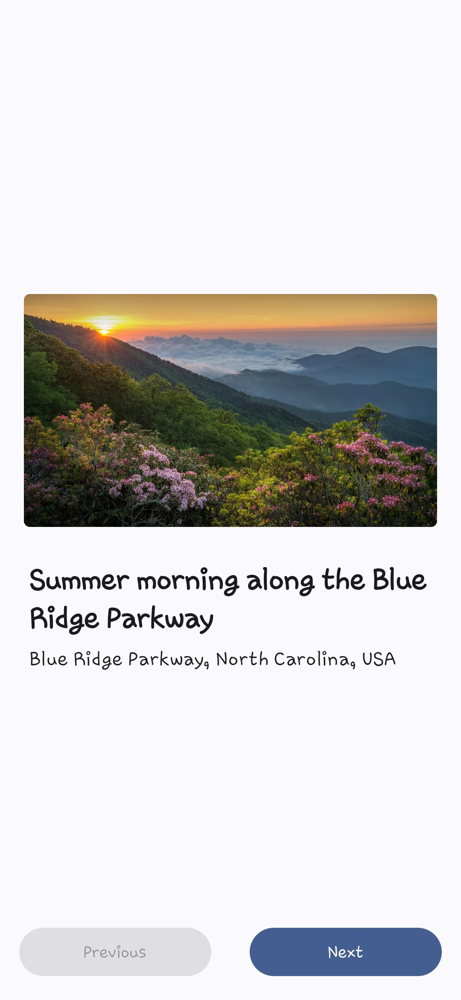
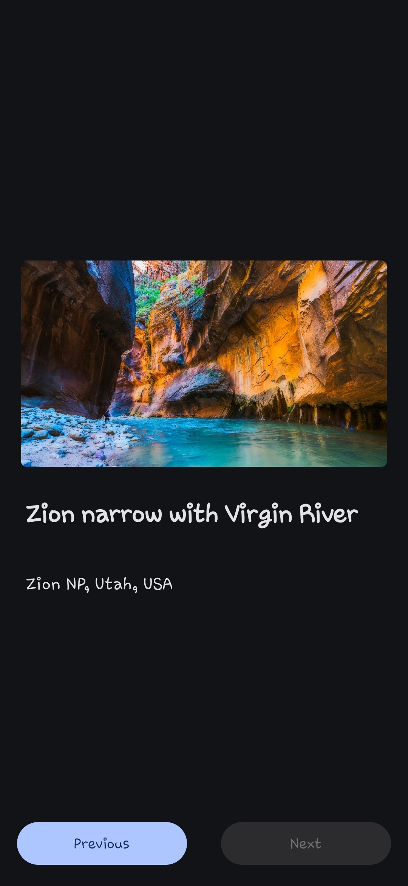
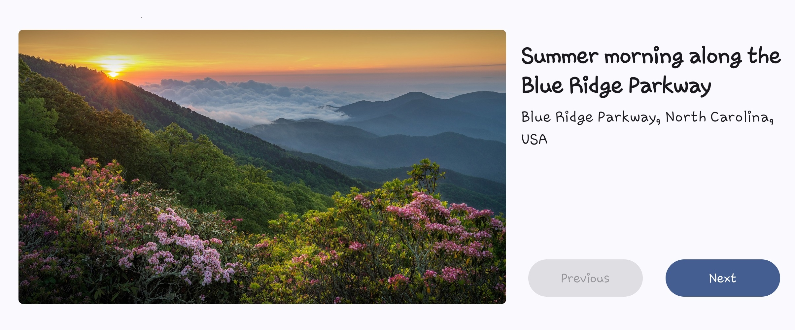
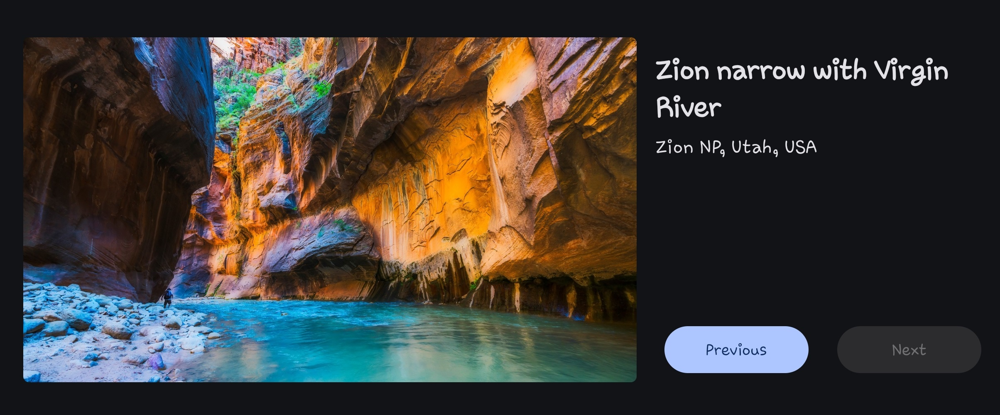

# Art Space App

Art Space is a Jetpack Compose app that displays a gallery of artworks with swipe gestures and buttons to navigate between them. The app features an adaptive layout that adjusts to both portrait and landscape orientations. This project is a practice exercise for learning interactive elements, state management, and adaptive layout in Jetpack Compose.

## New Concepts Learned

- **Components**:

  - `Button` for user interaction.

- **State Management**:
  - Understanding the concept of `State` in Jetpack Compose and how it drives the UI.
  - `State Hoisting` to move state up to make composables more reusable.
  - Updating state with `remember` and `mutableStateOf`. Button clicks and swipe gestures to change state.
  
- **Adaptive Layout**:
  - Creating responsive designs that adapt to both portrait and landscape orientations.

## Features

- **Art Gallery Display**:

  - Displays a gallery of artworks with swipe gestures to navigate between them.

- **Adaptive Layout**:

  - Responsive design that adjusts to both portrait and landscape orientations.

- **Interactive Elements**:
  - Buttons and swipe gestures to navigate through the art gallery.

## Usage

- Navigate through the art gallery by swiping left or right.
- Tap the "Next" and "Previous" buttons to navigate through the art gallery.
- Rotate the device to see the adaptive layout in action.
- Enjoy the beautiful artworks!

## Screenshots

### Portrait Mode

    
    

### Landscape Mode

